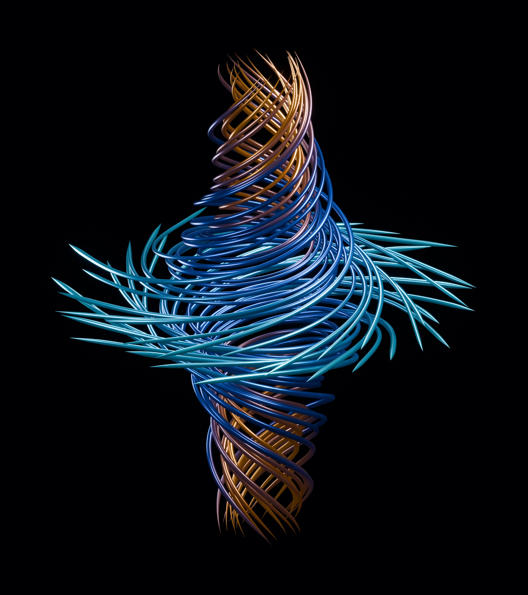

# VORTEX

**Make motion visible.**

An interactive study of fluid motion. Watch a luminous vortex assemble from particles, inspect its structure in **Flow Explorer**, and reveal the wake behind a giant fruit fly, a red race car, and a plane. Built with plain JavaScript, WebGL, and a fluid solver that runs in the browser.



## Watch. Explore. Compare.

**The motion study.** Follow a cloud of particles into 216 fine strands, 72 twisting flat ribbons, and 32 delicate supporting trajectories. The vortex assembles over 18 seconds as the camera pulls back; after the 30-second sequence, it continues a gentle twisting wave with a subtle lateral sway and traveling highlights. Pause, replay, or scrub the sequence.

**Flow Explorer.** Choose **Explore in 3D** to enter the dedicated `#explore` mode. Inspect the complete trajectory geometry, rotate and zoom freely, choose a side or axial view, and compare circulation, stretching, and viscosity. The animated twist and sway are removed so the underlying form is easier to examine. A compact parameter panel sits beside the scene; return to the animation whenever you want.

**The wind tunnel.** Switch between a detailed NeuroMechFly fruit fly, an original red Formula 1-style car, and an airplane. The unbranded race car has open wheels, a halo, suspension, and front and rear wings. Inspect each object in 3D while a two-dimensional lattice-Boltzmann simulation drives flow lines, particles, speed maps, and vorticity maps around its side silhouette.

The interface uses a dark canvas, restrained cyan and copper accents, and compact controls. Model notes, research credits, settings, and the optional film open in small panels beside the scene instead of blocking it with a full-screen modal. On narrow screens, a compact lower panel preserves space for the visualization above. Reduced-motion preferences open the vortex as a complete, stationary form.

## Run locally

No package installation, build step, account, or API key is required. Serve the `dist` directory over HTTP:

```sh
python3 -m http.server 8000 --bind 127.0.0.1 --directory dist
```

Open [localhost:8000](http://localhost:8000). Use a browser with WebGL and Web Worker support. Opening `index.html` directly as a file can prevent the worker and model requests from loading.

For direct access to Flow Explorer, open [localhost:8000/#explore](http://localhost:8000/#explore). The fragment is handled in the page; no server-side route is needed.

You can also publish the contents of `dist/` on a static web host. Preserve the relative file paths. The host should serve JavaScript, JSON, images, and any optional media with their usual MIME types.

## What is being simulated?

The vortex trajectories follow the **stationary Burgers vortex** velocity field:

```text
u_r     = −a r / 2
u_z     =  a z
u_theta = Γ / (2πr) · [1 − exp(−a r² / (4ν))]
```

Here `Γ` controls circulation, `a` controls axial stretching, and `ν` is kinematic viscosity. The radial proportions of the top and bottom are art directed. Particle assembly, camera movement, traveling highlights, and gentle deformation are also artistic presentation of the geometry. They do not simulate a vortex forming in time or demonstrate a solution to the Navier–Stokes Millennium Problem.

The wind tunnel runs a **D2Q9 BGK lattice-Boltzmann solver** on a 288 × 144 grid. The visible 3D mesh supplies a fixed, two-dimensional side silhouette to the calculation. The displayed wake deficit measures local slowing of the flow; it is **not a drag coefficient**. This experiment does not estimate real vehicle efficiency, an animal's drag, or a wing's three-dimensional lift.

See [architecture and numerical notes](docs/architecture.md) for the data flow and exact scope of the model.

## Project layout

```text
dist/
  index.html           Page, controls, and scene containers
  styles.css           Main interface and responsive layout
  explorer.css         Flow Explorer, compact panels, and responsive docking
  live-scene.css       Scene presentation and live-view layout
  vortex.js            Vortex geometry, animation, camera, and interaction
  cosmos.js            WebGL post-processing
  interface.js         Explorer routing, panels, navigation, and media controls
  soundtrack.js        Optional audio and playback synchronization
  aero.js              Wind-tunnel scene, meshes, fields, and interaction
  aero.css             Wind-tunnel interface
  aero-worker.js       Background calculation and field updates
  aero-solver.js       D2Q9 BGK fluid solver
  assets/aero/         Fruit fly, car, and plane meshes with silhouette masks
docs/
  architecture.md     Rendering, choreography, solver, and limitations
```

There are no third-party JavaScript runtime libraries. System fonts provide a fallback if optional web fonts cannot load. Model geometry and simulation state remain in the browser.

## Optional soundtrack

The public source package does **not** include the film soundtrack used during development. The visual experience works without it.

To use your own licensed instrumental track, place it at `dist/assets/soundtrack.m4a` and give the existing audio element in `dist/index.html` this source:

```html
<audio data-soundtrack src="assets/soundtrack.m4a" loop preload="auto"></audio>
```

The sound controller attempts playback with the scene, synchronizes pause and replay, and pauses when the page is hidden. Browsers may require a real visitor interaction before permitting audible playback. Distribute only music for which you have the necessary rights.

## Credits

- Further reading on browser-based lattice-Boltzmann experiments: [Daniel V. Schroeder's fluid simulation](https://physics.weber.edu/schroeder/fluids/).
- The vortex, car, and plane geometry were created for this project. The fruit fly uses NeuroMechFly v2 anatomy (NeLy / EPFL), adapted in Blender with display colours, wing membranes, veins, bristles and a static pose. The fly has a closer camera for a large, detailed view. See [model attribution](dist/assets/aero/licenses/NeuroMechFly-NOTICE.txt), [Apache-2.0 license](dist/assets/aero/licenses/NeuroMechFly-LICENSE.txt) and [modifications](dist/assets/aero/licenses/VORTEX-MODIFICATIONS.txt).

The project uses its own rendering and solver implementation. NeuroMechFly geometry and the associated adaptation notices are included under their original terms.

## Licensing

A license for the original application source has not yet been selected. The NeuroMechFly asset remains under Apache-2.0; its notices are included with the model. Third-party film audio is excluded from this source package and is not covered by any future source-code license.
